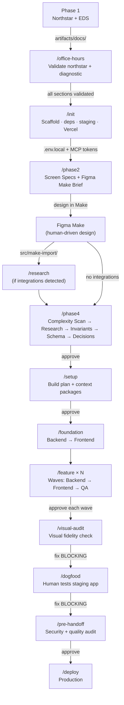

# RAD Guide — From Idea to Production

This is the step-by-step operating manual for the RAD template. Follow it in order. Every step has a clear completion signal before you move on.

---

## Before You Start

### Machine Setup (once per machine)

**Accounts:**
- [ ] [Supabase](https://supabase.com) — create two projects: dev + production
- [ ] [Vercel](https://vercel.com) — connect your GitHub account
- [ ] Payment provider — only if the product monetizes. Stripe, PayOS, or whatever the northstar specifies. Get test mode keys.
- [ ] [Resend](https://resend.com) — only if the product sends email. Get an API key.

**Cursor settings:**
- [ ] Settings → Features → Agent → Auto-run terminal commands → On
- [ ] Settings → Features → Agent → Auto-apply edits → On
- [ ] Model: Claude Sonnet 4 (or latest) as default

**Global MCP server** — add Context7 to `~/.cursor/mcp.json`:

```json
{
  "mcpServers": {
    "context7": {
      "command": "npx",
      "args": ["-y", "@upstash/context7-mcp"]
    }
  }
}
```

### Create the Repo

```bash
gh repo create [app-name] --template your-org/rad-starter --private --clone
cd [app-name]
```

---

## Phase 1 — Product Definition (external)

Phase 1 happens outside Cursor — in Claude.ai, Gemini, or any collaborative environment where the team can brainstorm, share with stakeholders, and iterate freely. The Phase 1 skill template (`.cursor/skills/phase1/SKILL.md`) is the reference specification for what the northstar and EDS must contain.

Produce two documents:

| Output | Format | What it is |
|---|---|---|
| `artifacts/docs/northstar-[app].html` | HTML | Product northstar — 12 required sections covering problem, user, solution, revenue, moat, scope, auth, integrations, payment, feature waves |
| `artifacts/docs/emotional-design-system.md` | Markdown or HTML | Brand voice, visual direction, emotional register, copy tone, forbidden patterns |

Place both in `artifacts/docs/` before running `/office-hours`.

### Northstar structure (12 required sections)

| § | Section | What downstream phases extract |
|---|---|---|
| 1 | The Problem | EDS emotional thesis |
| 2 | Primary User | Persona, daily context, emotional state |
| 3 | The Solution | Screen list, navigation paths |
| 4 | Revenue Model | Payment schema, pricing screens |
| 5 | Value Proposition | Landing page headline |
| 6 | Competitive Moat | Architectural decisions |
| 7 | Build Scope + Landing Content | Feature list, Make brief copy |
| 8 | Not Building | Tech spec exclusion list |
| 9 | Auth Model | Auth screens, RLS policies |
| 10 | External Integrations | SDK wrappers, env vars |
| 11 | Payment | Webhook handlers, checkout flow |
| 12 | Feature Grouping | Build plan wave structure |
| 13 | User Scenarios _(B2C, recommended)_ | Navigation flows, endpoint validation |

Each section has an extraction test — a downstream phase must be able to derive its inputs from this section alone without asking questions.

---

## Office Hours — Validation Gate

```
/office-hours
```

Run after placing Phase 1 artifacts in `artifacts/docs/`. Cursor's job here is enforcement — validating that the documents have enough structural completeness for downstream phases to succeed.

The command does four things:
1. **Structural validation** — checks that all 12 sections are present and substantive (not placeholder text). Flags gaps with specific section numbers.
2. **5-question diagnostic** — challenges the idea: who is the user, what job is the product doing, what does the 10-star version look like, what are you not building, what's the unfair advantage.
3. **Stack fit check** — scans northstar requirements against known RAD stack constraints (Edge Function timeouts, Realtime connection limits, file processing caps, authorization complexity, search requirements). Flags mismatches before any code is written, with options: reduce scope, add an external service, accept risk, or acknowledge RAD isn't the right template.
4. **Assumption extraction** — identifies the key assumptions the northstar makes about user behavior. Records what breaks if each assumption is wrong and how to validate post-launch. These feed the dogfooding step later.

**Gate:** All 12 sections pass validation. If 3+ sections are weak or missing, the human completes them before proceeding.

---

## Init + Environment Setup

### Configure Environment

Copy `.env.example` to `.env.local` and fill in values:

| Variable | Where to get it | Required? |
|---|---|---|
| `VITE_SUPABASE_URL` | Supabase → Project Settings → API → Project URL | Yes |
| `VITE_SUPABASE_PUBLISHABLE_KEY` | Supabase → Project Settings → API → anon/public key | Yes |
| `SUPABASE_SERVICE_ROLE_KEY` | Supabase → Project Settings → API → service_role key | Yes (Edge Functions only) |
| `RESEND_API_KEY` | Resend → API Keys | Only if app sends email |
| *Payment provider vars* | Per northstar §11 | Only if app monetizes |

> `.env.local` is gitignored. Never commit it.

### Initialize the Project

```
/init
```

The Tech Lead scaffolds the React Router v7 project, installs dependencies, validates the northstar structure, fills in `copy-rules.mdc` from the EDS, creates the staging branch, and links Vercel.

**After `/init`:**
- [ ] Fill in `.env.local` values
- [ ] Fill in `.cursor/mcp.json` tokens (Supabase + Vercel)
- [ ] Place PWA icons in `public/icons/` (192×192 + 512×512)
- [ ] Place a `.woff2` font in `public/fonts/`

---

## Phase 2 — Screen Planning

```
/phase2
```

The Product Designer produces:
1. **Screen specs** — routes, components, data variables, interaction flows, copy slots, loading/error/empty states
2. **Figma Make brief** — structured prompt with brand context, anti-patterns, and per-screen content hierarchy

**Gate:** Review both files → approve.

---

## Phase 3 — Design in Figma Make (you do this)

Take the Figma Make brief and build the complete app prototype. This is the most important human step.

**What Make produces:** A complete working React + Tailwind app — every button works, every form submits, every list renders, all with hardcoded mock data.

**Tips for good output:**
- Paste the Brand Context section into Make's custom rules
- Use realistic mock data (names, dates, prices from the brief)
- Use property names that map to database columns (`displayName`, `creditBalance`)
- Include 3–5 items in lists for visual density
- Let Make handle all visual decisions — colors, typography, spacing, animations

**When done:**
1. Go to Make's Code tab
2. Copy ALL files into `src/make-import/`
3. Tell the Tech Lead to proceed

---

## Phase 4 — Tech Spec

### Research (if external integrations)

If the northstar includes external APIs (payment, LLM, email), run research first:

```
/research stripe openai
```

### Complexity Scan + Selective Technical Research (automatic)

Phase 4 begins with a complexity scan — the Tech Lead reads the architecture reference (`.cursor/skills/architecture/SKILL.md`) and checks each feature against a checklist of complexity signals:

| Signal category | Examples |
|---|---|
| Money / Credits | Credit balance, subscriptions, refunds, webhook-driven state |
| Real-Time | Live updates, collaborative editing, presence |
| File Processing | Large uploads, file transformation, document parsing |
| Complex Authorization | Shared resources, role-based access, ownership transfer |
| Search / Filtering | Full-text search, faceted filtering, fuzzy matching |
| State Machines | Lifecycle entities, multi-step workflows |

For each triggered signal, the Research Agent is dispatched in Mode 2 (technical pattern research) to investigate the correct implementation pattern on the RAD stack. This produces `artifacts/integrations/pattern-[feature].md` — a focused doc with the recommended schema, concurrency strategy, and anti-patterns for that specific feature.

Features with no triggered signals skip research — standard CRUD on Supabase doesn't need investigation.

### Data Invariants

Before deriving the schema, Phase 4 enumerates data invariants — business rules that must always be true. These come from the northstar, domain knowledge, and technical pattern research — not from mock data shapes:

- "A user's credit balance must never go negative"
- "Every credit change must have a corresponding transaction record"
- "A purchase must be idempotent (webhook retries must not double-charge)"

Invariants drive schema decisions: CHECK constraints, unique indexes, trigger functions, RLS policies. A schema designed from mock data alone is structurally correct but doesn't enforce business rules.

### Generate Tech Spec

```
/phase4
```

The Tech Lead follows this sequence:
1. Complexity scan — check each feature against complexity signals
2. Dispatch Research Agent (Mode 2) for features with triggered signals
3. Read pattern research outputs + architecture reference patterns
4. Enumerate data invariants from northstar + domain + pattern research
5. Extract entities from Make mock data + northstar
6. Design schema from invariants + entities + access patterns
7. Run the schema anti-pattern checklist (15 checks against known failure modes)
8. Document technical decisions using the TD-N template (options considered, research basis, risks, revisit triggers)
9. Write Edge Function contracts, data hooks, auth model

**Gate:** Review `artifacts/docs/tech-spec.md` → approve.

---

## Setup

```
/setup
Supabase dev project ref: [ref]
Monetizes: [yes/no]
```

The Tech Lead produces `artifacts/plans/build-plan.md` — the feature dependency graph with per-feature context packages.

**Gate:** Review `build-plan.md` → approve.

---

## Foundation (~1.5h, unattended)

```
/foundation
```

Two agents run sequentially:

**Backend Foundation:**
- Supabase client, AuthProvider, types, hooks
- Schema migrations + RLS policies + seed data
- Edge Functions (payment webhook, email — if applicable)
- Static SEO/PWA files (robots.txt, sitemap.xml, manifest.json)
- Generate `database.types.ts`

**Frontend Foundation:**
- Move Make's `components/ui/` → `src/components/ui/` (as-is)
- Catalog components + build missing states (EmptyState, ErrorBanner, SkeletonCard)
- Port Make's CSS design tokens into `src/app.css`, self-host fonts
- Build landing page (validates everything works)
- Build auth screens (login, signup, OAuth callback)

**Result:** Landing page live on staging URL. Auth flow working end-to-end.

---

## Feature Waves

```
/feature auth
/feature profile-settings    ← Wave 1 features run in parallel
```

Each feature runs: **Backend → Frontend → QA**.

The frontend agent is an integrator, not a builder:
- Finds the Make component for each screen
- Ports JSX + Tailwind into a route file
- Swaps hardcoded mock data for real Supabase queries
- Replaces fake auth/nav/payment with real implementations
- Adds loading/error/empty states
- Keeps everything else Make generated — layout, styling, animations

### QA Process

The QA agent scopes testing to changed files using `git diff`, runs acceptance criteria validation, and produces a health score:

| Dimension | Weight |
|---|---|
| Visual fidelity (Make spec match) | 15% |
| Data integrity + performance | 20% |
| Security (RLS + auth gates) | 20% |
| Interaction flow completeness | 20% |
| Build + test pass | 15% |
| Copy quality (EDS compliance) | 10% |

Bug fixes follow atomic commits — one fix per commit, with a regression test committed alongside. The fix loop includes self-regulation: if fixes are causing more reverts than progress, the agent stops and escalates.

**Gate:** Approve each QA PASS → next wave starts.

---

## Visual Audit

```
/visual-audit https://[app]-staging.vercel.app
```

Product Designer checks every screen against Make's original components, slop guard rules, mobile viewport, interaction states, copy quality, and landing page completeness.

**Gate:** Fix all BLOCKING findings.

---

## Dogfooding — Structured Product Testing

```
/dogfood
```

Between visual audit and pre-handoff, the builder uses the staging app as a real user for 30–60 minutes. This step catches problems that specs and agents cannot anticipate — confusing flows, wrong defaults, missing affordances, awkward copy in context.

The Tech Lead generates a task list covering:
- **Core loop tasks** — complete the core loop 3 times with different inputs
- **Edge case tasks** — mobile viewport, auth boundaries, form abandonment, back button, error states
- **Assumption validation** — tasks mapped to each assumption from office hours (what breaks if the assumption is wrong?)
- **Emotional assessment** — first-time experience, core loop feeling, hesitation points, missing expectations

After completing the tasks, findings are recorded in `artifacts/qa-reports/dogfood-report.md` with severity ratings (BLOCKING / SHOULD_FIX / NICE_TO_HAVE) and assumption validation results (VALIDATED / INVALIDATED / UNCLEAR).

**Gate:** Fix all BLOCKING findings. SHOULD_FIX items carry into pre-handoff.

---

## Pre-Handoff

```
/pre-handoff
```

QA Agent runs a comprehensive audit:
- **Security** — OWASP Top 10 checks, RLS gap analysis, secrets-in-bundle scan, Edge Function validation, dependency supply chain review
- **Quality** — N+1 queries, race conditions, dead code, missing indexes, paywall gate integrity

AUTO-FIX items are applied directly. BLOCKING items are escalated with evidence.

**Gate:** Resolve all BLOCKING items → approve.

---

## Deploy

```
/deploy [production-supabase-ref]
```

DevOps Agent:
1. Pushes schema to production Supabase
2. Deploys Edge Functions
3. Lists env vars for Vercel Dashboard
4. Registers webhooks (if applicable)
5. Merges staging → main → confirms production is live

### Post-Deploy Smoke Check

- [ ] Production loads, signup works, core loop completes
- [ ] Payment works (test mode) and webhook fires
- [ ] Landing page renders with OG tags
- [ ] PWA installs on Android, iOS shows instructions
- [ ] Lighthouse: LCP ≤ 2.5s, CLS ≤ 0.1, INP ≤ 200ms

### Commercial Readiness (your responsibility)

- [ ] Privacy Policy + Terms of Service pages
- [ ] Cookie consent (if analytics/ad pixels)
- [ ] Switch payment provider to live keys → re-deploy

---

## Agent Protocols

Every agent in the system follows three shared protocols.

### Structured Questions

When any agent needs a decision, questions follow a 4-part format:
1. **Re-ground** — state the project, current branch, and task (assume the reader hasn't looked in 20 minutes)
2. **Simplify** — explain the problem in plain English with concrete examples
3. **Recommend** — one recommended option with a completeness score (10 = full implementation, 7 = happy path only, 3 = shortcut deferring work)
4. **Options** — lettered choices with effort estimates

### Completion Signals

Every dispatch ends with a status: DONE, DONE_WITH_CONCERNS, BLOCKED, or NEEDS_CONTEXT. Evidence is provided for each claim.

### Escalation

If an agent has attempted a task 3 times without success, is uncertain about a security-sensitive change, or the scope exceeds what it can verify — it stops, reports what was tried, and recommends what to do next.

---

## Specialist Skills

| Skill | Purpose | When to use |
|---|---|---|
| `architecture` | Stack constraints, complexity signals, domain patterns, decision template | During `/office-hours` (stack fit) and `/phase4` (technical decisions) |
| `phase1` | Northstar + EDS template with extraction tests | Writing Phase 1 artifacts from scratch |
| `investigate` | 4-phase root cause analysis | Complex bugs spanning 3+ files |
| `security-audit` | OWASP + RLS + secrets + deps audit | During `/pre-handoff`, or manually |
| `testing` | 66 automated rule checks | Runs on agent stop via hooks |

---

## Session Management

```
/session-start    ← restores context, reports current status + next action
/session-end      ← saves session memory, updates project state
```

If a session drops without `/session-end`, the memory file still contains all work blocks — context is never fully lost.

---

## Emergency Procedures

**Session drops mid-work:**
Run `/session-start`. It reads `ACTIVE_CONTEXT.md` and today's memory log and picks up from the last written block.

**Agent drops mid-feature:**
Run `/status` to see where things stand, then re-dispatch the specific agent.

**Build fails:**
Fix before building the next feature. Each agent runs `npm run build` before committing.

**Scope change during build:**
1. Stop the current feature workstream
2. If schema/API changes needed: update `tech-spec.md`, run `/regen-feature [name]`, re-dispatch
3. If new feature: add to `build-plan.md`, assign to a wave, dispatch as `/feature`
4. Log in `artifacts/docs/changelog.md`

---

## Workflow Diagram



---

## Quick Reference

| Command | Who | Output |
|---|---|---|
| `/office-hours` | Tech Lead | Northstar validation + product diagnostic |
| `/init` | Tech Lead | Scaffolded workspace |
| `/phase2` | Product Designer | Screen specs + Make brief |
| `/phase4` | Tech Lead | Tech spec (complexity scan → research → invariants → schema → decisions → contracts) |
| `/setup` | Tech Lead | Build plan |
| `/foundation` | Backend → Frontend | Infra + components + landing + auth |
| `/feature [name]` | Backend → Frontend → QA | Feature layers + tests + health score |
| `/visual-audit [url]` | Product Designer | Visual fidelity report |
| `/dogfood` | Human + Tech Lead | Dogfood report + assumption validation |
| `/pre-handoff` | QA Agent | Security + quality audit |
| `/deploy [ref]` | DevOps Agent | Production live |

| Utility | What it does |
|---|---|
| `/session-start` | Restore context, report status |
| `/session-end` | Save session memory |
| `/status` | Phase/feature/health diagnostic |
| `/research [name]` | Research external integration |
| `/regen-feature [name]` | Regenerate feature context after amendment |
| `/new-feature [desc]` | Post-launch feature cycle |
